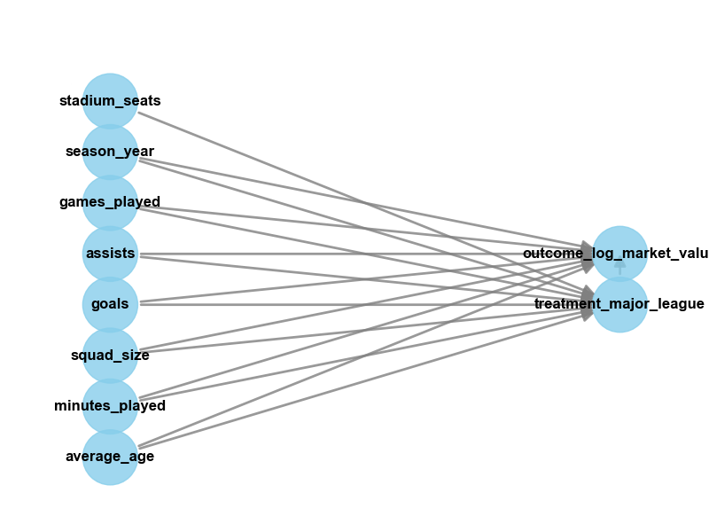

# Football Market Value Predictor: Causal ML + DoWhy

This project sits at the intersection of two things I care about deeply:
- football intelligence,
- machine learning that supports better decisions.

Instead of only predicting market value, this notebook asks a stronger question:
**What is the causal impact of playing in a major league on player market value?**

## Project Highlights
- End-to-end data pipeline on football player and club features
- Predictive ML for market value estimation
- CausalML meta-learners for treatment effect estimation
- DoWhy causal modeling with refutation checks
- Interpretable outputs with feature importance and SHAP analysis

## Main Notebook
- `ML_Causal_DoWhy_football-market-value-predictor.ipynb`

## Causal Graph


## Problem Statement
Football market values are influenced by performance, context, and league environment.  
The goal is to estimate whether major-league participation has a **causal** impact on market value after controlling for confounders.

## Dataset
- Transfermarkt-style player, appearance, club, and competition data
- Outcome:
  - `outcome_log_market_value = log1p(market_value_in_eur)`
- Treatment:
  - `treatment_major_league = is_major_national_league`
- Core controls:
  - `games_played`, `minutes_played`, `goals`, `assists`, `average_age`, `squad_size`, `season_year`
- Instrument (DoWhy interface 2):
  - `stadium_seats`

## Methods
### CausalML
- `LRSRegressor`
- `XGBTRegressor`
- Optional binary uplift check with `UpliftTreeClassifier`

### DoWhy
- Interface 2 (common causes + instruments)
- Graph interface (compact DAG)
- Refuters:
  - random common cause
  - data subset refuter
  - placebo or bootstrap fallback (version-safe)

## Key Results (from the executed notebook)
- CausalML ranking performance:
  - `XGBTRegressor` outperformed `LRSRegressor` on uplift ranking quality.
  - Example metrics:
    - `qini_auc_test`: 4882.293 (XGBT) vs 3272.470 (LRS)
    - `uplift_at_30pct_test`: 2.4148 (XGBT) vs 0.8907 (LRS)
    - Binary ranking: AUUC 0.8961 and Qini 0.2133 for XGBT
- DoWhy estimates:
  - Backdoor linear regression effect: 0.7342
  - IV effect: 2.3385
  - Graph-interface placebo refutation gave near-zero new effect

## Interpretation
- Major-league treatment shows a positive estimated effect direction across methods.
- Effect size varies by identification strategy, so assumptions matter.
- Top heterogeneity drivers include:
  - `games_played`
  - `minutes_played`
  - `season_year`
  - `national_team_players`
  - `stadium_seats`

## Run Locally
```bash
cd football-market-value-predictor
python -m pip install -U pip
python -m pip install numpy pandas matplotlib seaborn scikit-learn xgboost causalml dowhy shap pydot
jupyter notebook
```

Then open:
- `ML_Causal_DoWhy_football-market-value-predictor.ipynb`

## Tech Stack
- Python
- pandas, numpy
- scikit-learn, xgboost
- causalml
- dowhy
- shap
- matplotlib, seaborn

## Why This Project Matters
In football analytics, pure prediction is useful, but decision-makers need more than correlation.  
This project moves from "what is likely?" to "what changes if we intervene?" and that is where causal ML becomes powerful for scouting, valuation, and strategy.
